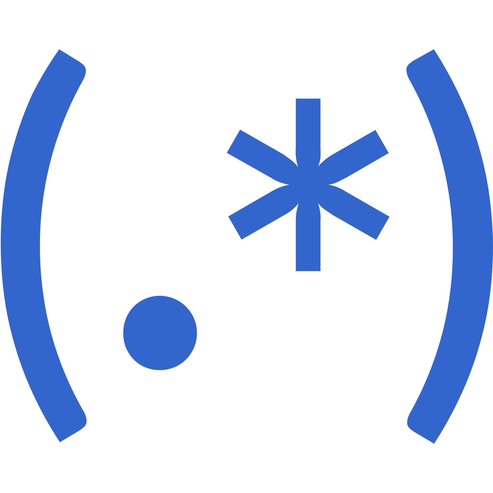

<h1>
	Hi there! I'm Patricia - aka Bethania!
</h1>

<h3>
	I'm currently a TA @ Ironhack
</h3>

- :computer: I've completed **Ironhack** 's Data Analytics bootcamp in May 2022
- :technologist::skin-tone-2: I have experience in teaching, coding, python, SQL, webscrapping, machine learning, data viz, etc
- :speaking_head_in_silhouette: Pronouns: she/her
- :sweat_smile: Fun facts: I hug tightly, I crack my phalanges and I whistle the songs' melodies when I don't remember the lyrics.
 

  <a href=""></a>
  <a href=""></a>
  <a href=""></a>

---

  <a href="https://github.com/betruchia">

  

---

  <h1 align="center">Tech Tools</h1>
  
  <table align="center">
  <tr>
    <td><h2 align="center">Data Analysis || Data Science</h2></td>
  </tr>
  <tr>
    <td> 
    

	
	
	
	
	
	
	
	
     
</td>
   

   </tr>
   </table>

   <table align="center">
  <tr>
    <td><h2 align="center">Databases</h2></td>
    <td><h2 align="center">Systems</h2></td>
    <td><h2 align="center">Miscellaneous</h2></td>
  </tr>
  <tr>
    <td> 
  

   
    
</td>

  <td height="auto" width="auto">  

  
  
</td>

  <td height="auto" width="auto">  

  
  
  

  
</td>
  </tr>
 </table>
